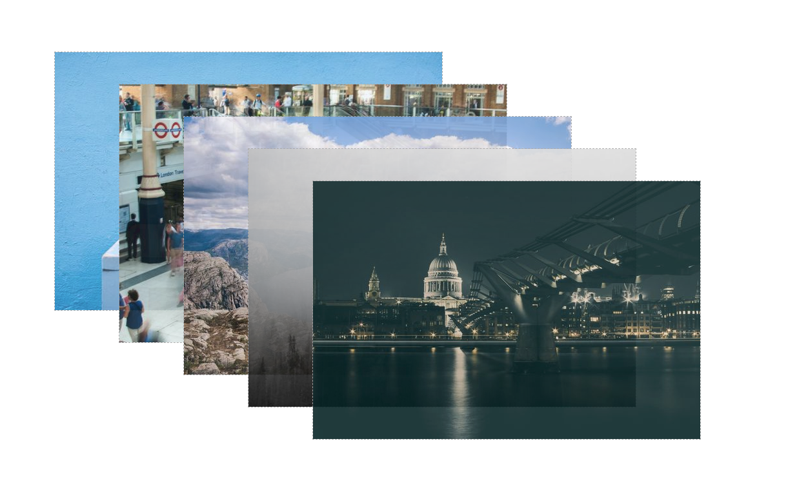
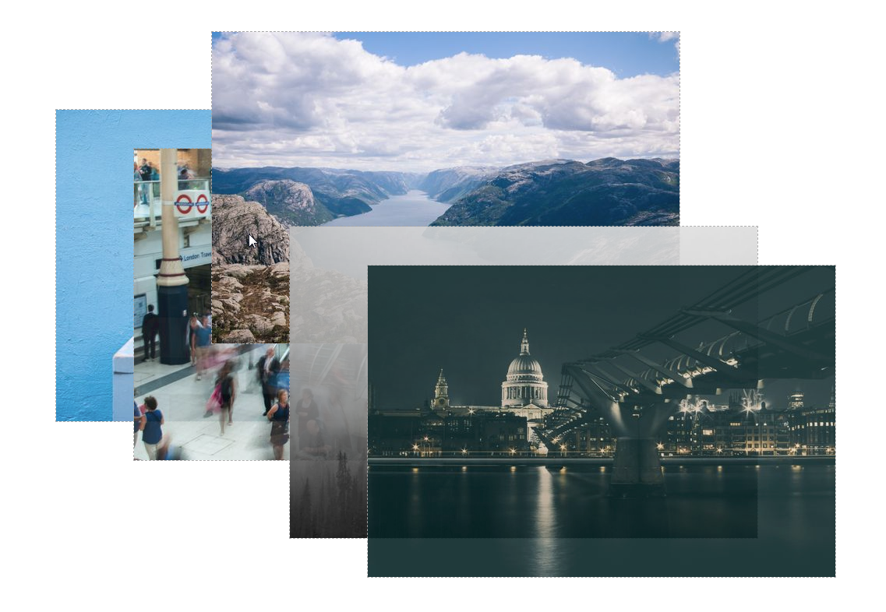

# Pozicovaní CSS procvičování: fotogalerie

## :exclamation::exclamation: Zadání :exclamation::exclamation:
1) vytvořte galerii podle zadání na obrázku
    - obrázky jsou od sebe vzdáleny na šířku 100px na na výšku 50px
2) pomocí translate vytvořte při najetí myši efekt vyjíždění a nastavte průhlednost na 1
3) vytvořený efektu nastavte plynulý přechod (transition)

## Ukázka řešení 

## Efekt vyjíždění 

